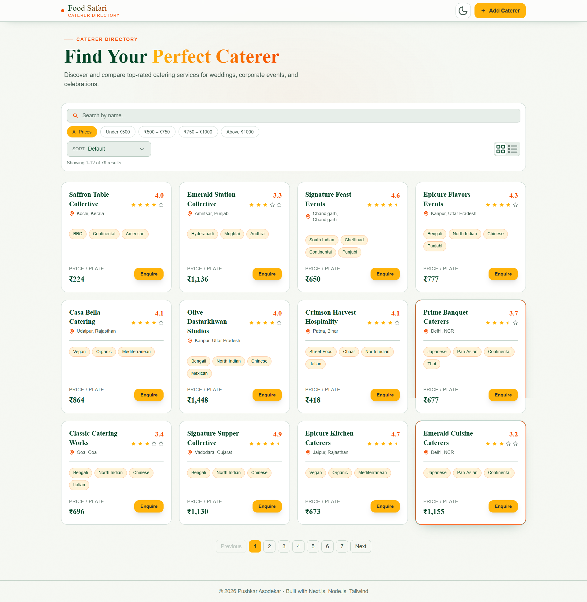
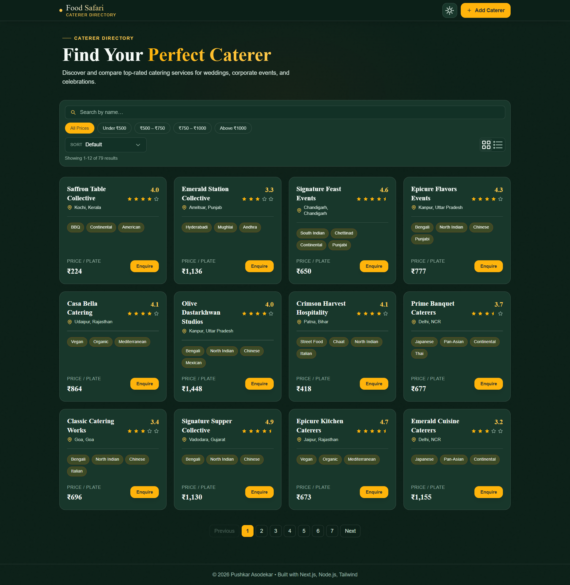
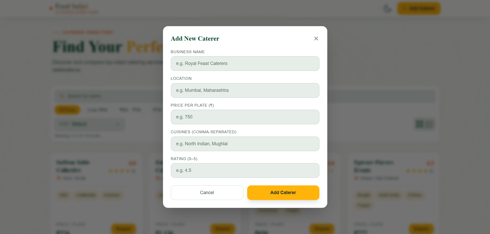
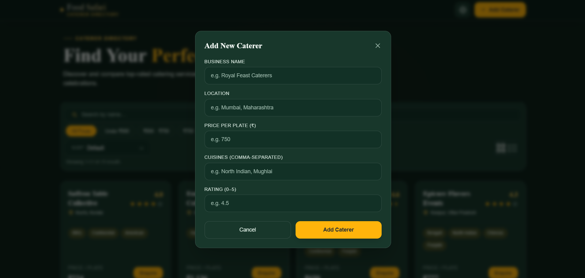

# Food Safari - Caterer Directory

A production-grade full-stack caterer discovery platform built with Next.js and Express.

**[Live Demo](https://food-safari-catererdirectory.vercel.app/)** | **[GitHub Repository](https://github.com/Pushkaraso19/food-safari.git)**

## Overview

Food Safari is a production-style full-stack caterer discovery platform. It allows users to browse, search, filter, sort, and paginate through caterer listings, submit new caterers, switch between light and dark themes, and trigger enquiry simulations from each listing card.

The project uses a Next.js App Router frontend and an Express MVC backend with a JSON-backed data layer.

## Features
- Search caterers by name (debounced, case-insensitive)
- Filter caterers by price range
- Sort caterers by price and rating
- Server-side pagination with metadata
- Create new caterer via modal form
- Light and dark theme system using design tokens
- Responsive UI for desktop and mobile
- Enquiry simulation with reference toast
- Grid and list view toggle

## Tech Stack
### Frontend
- Next.js 14 (App Router)
- React 18
- Tailwind CSS

### Backend
- Node.js
- Express.js
- Joi validation
- JSON file storage (`backend/src/data/caterers.json`)

## Architecture
### Backend (MVC + Service Layer)
- Controllers: handle request validation and HTTP responses
- Services: own business logic (filtering, sorting, pagination, creation)
- Models: Joi schemas and input validation
- Utils: file-based data access abstraction
- Middleware: centralized error and not-found handling

### Frontend (Component + Service Pattern)
- App Router pages define route-level composition and state
- Reusable UI components for cards, filters, sorting, pagination, modal, header/footer
- API service layer centralizes fetch logic and response/error handling
- Theme tokens defined in global CSS and consumed by Tailwind utility classes

## API Endpoints
### `GET /api/caterers`
Returns paginated caterers.

Query params:
- `page` (number, default `1`)
- `limit` (number, default `10`, max `100`)
- `search` (string, optional)
- `minPrice` (number, optional)
- `maxPrice` (number, optional)
- `sort` (optional): `price_asc`, `price_desc`, `rating_desc`, `rating_asc`

Response shape:

```json
{
  "data": [
    {
      "id": "uuid",
      "name": "Royal Feast Caterers",
      "location": "Mumbai",
      "pricePerPlate": 850,
      "cuisines": ["North Indian", "Mughlai"],
      "rating": 4.8
    }
  ],
  "pagination": {
    "total": 72,
    "page": 1,
    "limit": 12,
    "totalPages": 6
  }
}
```

### `GET /api/caterers/:id`
Returns one caterer by ID.

### `POST /api/caterers`
Creates a new caterer after Joi validation.

Sample request:

```json
{
  "name": "Royal Feast Caterers",
  "location": "Mumbai, Maharashtra",
  "pricePerPlate": 850,
  "cuisines": ["North Indian", "Mughlai"],
  "rating": 4.8
}
```

## Setup Instructions

### Quick Start on Vercel (Recommended)

The fastest way to get the project running is to deploy directly on Vercel:

#### Frontend Deployment on Vercel

1. Click **Deploy** on the [Vercel Dashboard](https://vercel.com/)
2. Select your forked GitHub repository
3. Configure:
   - **Framework Preset:** Next.js
   - **Root Directory:** `frontend`
   - **Environment Variable:** `NEXT_PUBLIC_API_URL` = Your backend URL
4. Click **Deploy** - your frontend will be live in seconds

#### Backend Deployment on Render

1. Visit [Render Dashboard](https://dashboard.render.com)
2. Create a **New Web Service**
3. Connect your GitHub repository
4. Configure:
   - **Name:** `food-safari-backend`
   - **Root Directory:** `backend`
   - **Build Command:** `npm install`
   - **Start Command:** `npm start`
5. Set Environment Variables:
   - `FRONTEND_URL` = Your Vercel deployment URL
   - `PORT` = `4000`
6. Deploy and note your backend URL

---

### Local Development Setup

For local development and testing:

#### 1) Clone Repository

```bash
git clone https://github.com/Pushkaraso19/food-safari.git
cd food-safari
```

#### 2) Install Backend Dependencies

```bash
cd backend
npm install
```

#### 3) Install Frontend Dependencies

```bash
cd ../frontend
npm install
```

#### 4) Configure Environment Variables

Copy templates and update values:

```bash
cd ../backend
cp .env.example .env

cd ../frontend
cp .env.example .env.local
```

#### 5) Run Backend

```bash
cd ../backend
npm run dev
```

Backend runs at `http://localhost:4000`.

#### 6) Run Frontend

```bash
cd ../frontend
npm run dev
```

Frontend runs at `http://localhost:3000`.

## Environment Variables

### Backend (`backend/.env`)

```env
PORT=4000
FRONTEND_URL=http://localhost:3000
```

For production (Vercel/Render):
```env
PORT=4000
FRONTEND_URL=https://your-vercel-app.vercel.app/
```

Template file: `backend/.env.example`

### Frontend (`frontend/.env.local`)

```env
NEXT_PUBLIC_API_URL=http://localhost:4000
```

For production (Vercel):
```env
NEXT_PUBLIC_API_URL=https://your-render-backend.onrender.com
```

Template file: `frontend/.env.example`

## GitHub Repository Best Practices

- Commit source code, `.env.example` files, and documentation only
- Never commit `.env` or `.env.local` files (add to `.gitignore`)
- Keep generated folders (`node_modules`, `.next`, coverage, logs) ignored via `.gitignore`
- Use clear commit messages (example: `feat: add server-side pagination`)

## Deployment and Hosting

This project is fully hosted on **Vercel** for both frontend and backend deployment:
- **Frontend:** Vercel (optimized for Next.js)
- **Backend:** Render

### Frontend Deployment (Vercel)

The frontend is deployed on **Vercel**, a platform optimized for Next.js applications.

1. Connect your GitHub repository on [Vercel](https://vercel.com/)
2. Configure build settings:
   - **Base directory:** `frontend`
   - **Build command:** `npm run build`
   - **Publish directory:** `.next`
3. Add environment variable:
   - `NEXT_PUBLIC_API_URL` = Your deployed backend URL from Render
4. Deploy and your site will be live at `https://food-safari-catererdirectory.vercel.app/`

### Backend Deployment (Render)

1. Create a new Web Service on [Render Dashboard](https://dashboard.render.com)
2. Connect your GitHub repository
3. Set the following configuration:
   - **Root Directory:** `backend`
   - **Build Command:** `npm install`
   - **Start Command:** `npm start`
4. Add environment variables:
   - `PORT` = `4000` (or leave empty for Render to assign)
  - `FRONTEND_URL` = `https://food-safari-catererdirectory.vercel.app/`
5. Deploy and note the backend URL (e.g., `https://your-backend.onrender.com`)

### Frontend Deployment (Vercel)

1. Connect your GitHub repository on [Vercel](https://vercel.com/)
2. Configure build settings:
   - **Base directory:** `frontend`
   - **Build command:** `npm run build`
   - **Publish directory:** `.next`
3. Add environment variable:
   - `NEXT_PUBLIC_API_URL` = Your deployed backend URL from Render
4. Deploy and your site will be live at `https://food-safari-catererdirectory.vercel.app/`

### CORS Configuration

Ensure backend `FRONTEND_URL` environment variable matches your Vercel frontend domain so API calls are allowed.

## Screenshots

### Home Page - Light Mode


### Home Page - Dark Mode


### Create Caterer Modal


### Create Caterer Modal - Dark Mode


## Live Demo

Experience the application live:
- **Web App:** [https://food-safari-catererdirectory.vercel.app/](https://food-safari-catererdirectory.vercel.app/)
- **Source Code:** [https://github.com/Pushkaraso19/food-safari.git](https://github.com/Pushkaraso19/food-safari.git)

## Author

Pushkar Asodekar
